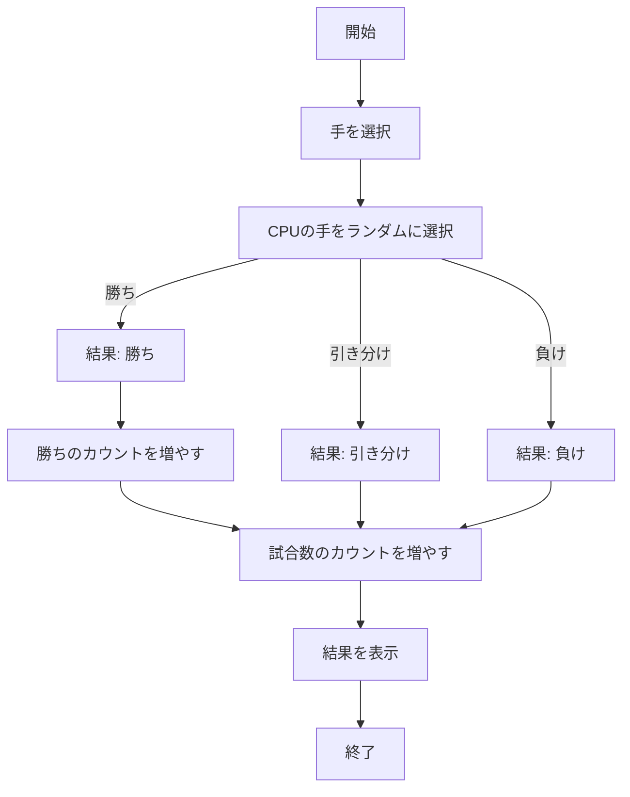
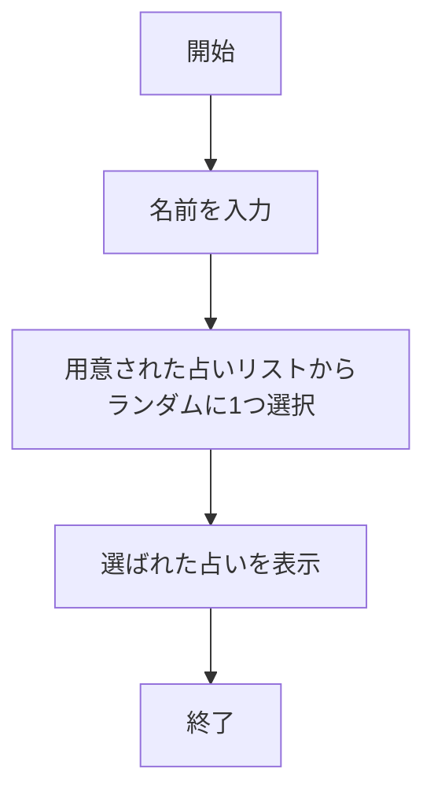

# webpro_06

## 起動方法

コンピュータとじゃんけんできる機能とBMIを計算できる機能,占いができる機能の3つを作成した.

起動する際はターミナルで＄cd webpro_06→＄cd janken-app　このようにディレクトリを移動した後,＄node app.jsこのコマンドでサーバーを立ち上げる.そうしたら

・じゃんけん　http://localhost:8080/janken

・BMI　http://localhost:8080/bmi

・占い　http://localhost:8080/fortune

上記のURLで起動することができるようになる.

じゃんけんの機能は自身がグー,チョキ,パーの中から出す手を選び,3つの手からランダムに出してくるコンピュータと勝敗を決めるというものである.この機能はユーザーが勝った回数と総試合数も記録している.

BMIの機能は身長と体重を入力することでBMIを算出し,一般的にどの程度の肥満度なのかを表示してくれるものである.

占いの機能は名前を入力することで5種類の一言のうちの1つを表示してくれるというものである.なお,入力する名前は結果には一切影響しない.

## ファイル一覧

| ファイル名　　　　　　　                   | 説明               |
|--------------------------------------|-------------------|
| `janken-app/views/app5.js`           |　プログラム本体       |
| `janken-app/views/janken.ejs`        |　じゃんけん開始画面    |
| `janken-app/views/foryune.ejs`       |　占い開始画面       　|
| `janken-app/views/bmi.ejs`           |　bmi算出機能開始画面 　|
| `janken-app/views/jankenResult.ejs`  | じゃんけん結果表示画面　|
| `janken-app/views/fortuneResult.ejs` | 占い結果表示画面      |
| `janken-app/views/bmiResult.ejs`     | bmi結果表示画面      |

## じゃんけんのフローチャート

## 占いのフローチャート

## BMIのフローチャート
```mermaid
flowchart TD;
   A[開始] --> B[身長と体重を入力];
   B --> C[BMIを算出];
   C --> D[BMIが18.5未満];
   C --> E[BMIが18.5以上24.9未満];
   C --> F[BMIが24.9以上29.9未満];
   C --> G[BMIが29.9以上34.9未満];
   C --> H[BMIが34.9以上39.9未満];
   C --> I[BMIが39.9以上];
   D --> J[結果: 低体重];
   E --> K[結果: 正常体重];
   F --> L[結果: 肥満(1度)];
   G --> M[結果: 肥満(2度)];
   H --> N[結果: 肥満(3度)];
   I --> O[結果: 肥満(4度)];
   J --> P[算出されたBMIと結果を表示];
   K --> p;
   L --> p;
   M --> p;
   N --> p;
   O --> p;
   P --> Q[終了];
```


